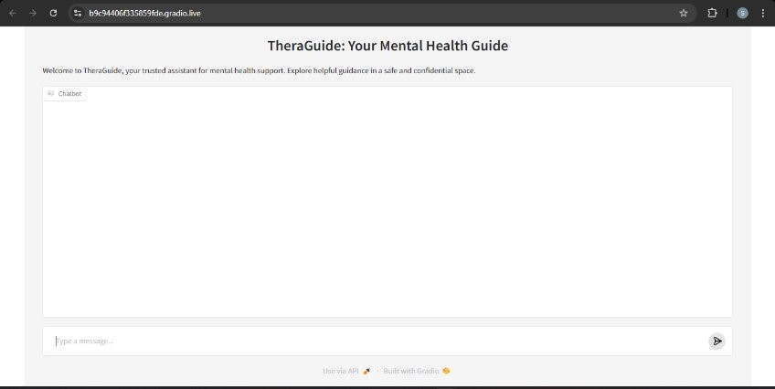
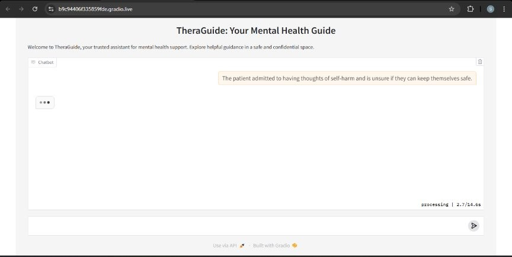

# TheraGuide : Mental Health Support Chatbot

## Overview

This project aims to support mental health line workers by providing a Retrieval-Augmented Generation (RAG)-based chatbot. The chatbot is designed to assist workers by analyzing conversation summaries and providing actionable insights. It classifies the patient's condition into severity categories and offers tailored suggestions to ensure better care and improved patient safety.

## Key Features

### Patient Condition Classification:

Analyzes the input summary of a conversation with the patient.

Categorizes the patient's condition into mild, intermediate, or extreme levels.

### Actionable Suggestions:

Provides specific recommendations for mental health line workers to handle the situation more effectively.

Ensures suggestions align with best practices in mental health care.

## Methods
### Model: 
1. Fine-tuned llama-3-8B-instruct model on two specialized mental health datasets.
2. Experimented with 5 different RAG configurations to optimize performance.
3. Evaluated all the models qualitatively using Chatgpt 4o mini as our evaluation tool.
4. Deployed the best-performing RAG model using Gradio for a user-friendly interface.

## RAG Configuration Results

## RAG Configuration Results

| **Embedding Model**          | **Chunk Size** | **Chunk Overlap** | **Retriever**        | **Generation Model**      | **Embedding Size** | **Changes Made**            | **Score** |
|------------------------------|----------------|-------------------|----------------------|---------------------------|--------------------|----------------------------|-----------|
| all-mpnet-base-v2            | 2000           | 200               | VectorStore          | Llama-3-8B-Instruct       | 768                | Base Model                 | 7.06      |
| all-mpnet-base-v2            | 1000           | 100               | VectorStore          | Llama-3-8B-Instruct       | 768                | Reduced chunk size         | 7.18      |
| thenlper/gte-base            | 1000           | 100               | VectorStore          | Llama-3-8B-Instruct       | 768                | Different embedding model  | 7.5       |
| thenlper/gte-large           | 1000           | 100               | VectorStore          | Llama-3-8B-Instruct       | 1024               | Different embedding model  | 7.48      |
| thenlper/gte-base            | 1000           | 100               | ParentChildRetriever | Llama-3-8B-Instruct       | 768                | Different retriever        | 6.86      |

## LLM vs Fine-tuned LLM vs RAG
| **Models**        | **Score** |
|-------------------|-----------|
| LLM               | 5.81      |
| Fine-tuned LLM    | 7.26      |
| RAG               | 7.5       |

## UI Snapshots

